# Guía del usuario — Navaja Suiza

Bienvenido a la Navaja Suiza. Esta guía te explica, paso a paso, cómo usar cada herramienta de la aplicación.

> Esta guía es un documento vivo: se actualiza a medida que la aplicación suma funciones.

---

## Contenido

1. Pizarra
2. Afinador
3. Metrónomo
4. Cronómetro
5. Linterna
6. Brújula
7. Notas
8. Lector de documentos

---

## 1. Pizarra

La pizarra te permite dibujar a mano alzada sobre una superficie blanca y guardar tu dibujo como imagen.

| | |
|---|---|
| 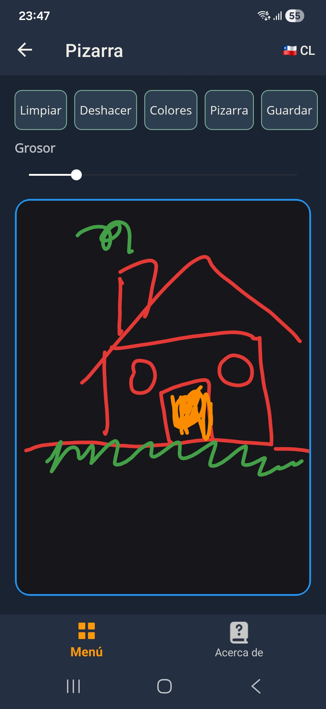 | 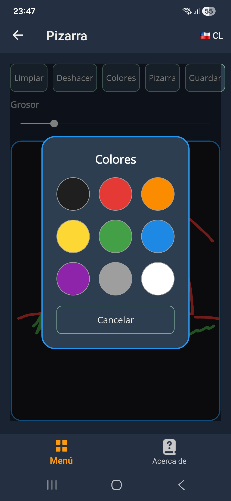 |

### Cómo se usa

- Elige un color con el botón de la paleta (rueda de colores).
- Dibuja arrastrando el dedo sobre la superficie blanca.
- Usa el borrador para corregir un trazo.
- Deshaz el último trazo con el botón de la flecha.
- Limpia toda la pizarra con el botón de la papelera.
- Guarda tu dibujo como imagen con el botón de guardar.

### Consejos

- El grosor del trazo se ajusta con el control deslizante de la parte de arriba.
- La pizarra se adapta al tema claro y oscuro de la aplicación.
- Si cambias el color del fondo, el lápiz ajusta su contraste automáticamente para que siempre se vea.

---

## 2. Afinador

El afinador te permite reproducir las notas de varios instrumentos para afinar el tuyo de oído. Están disponibles:

- Guitarra y guitarra criolla (nylon).
- Guitarra steel (acero).
- Bajo.
- Ukelele.
- Violín.
- Charango.

| | |
|---|---|
| 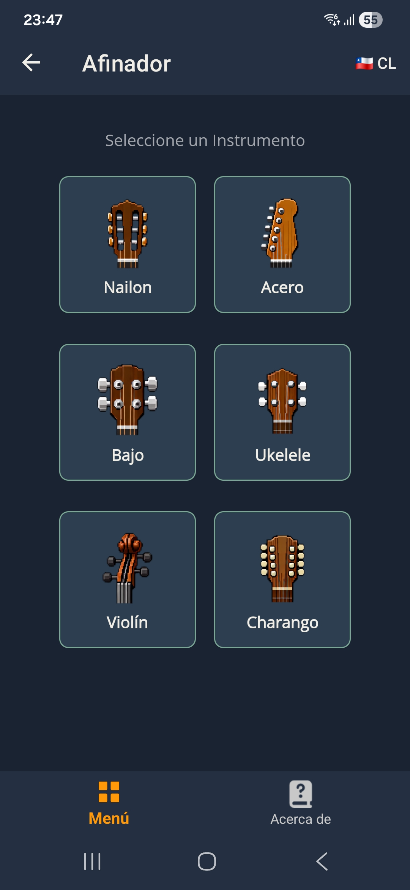 | 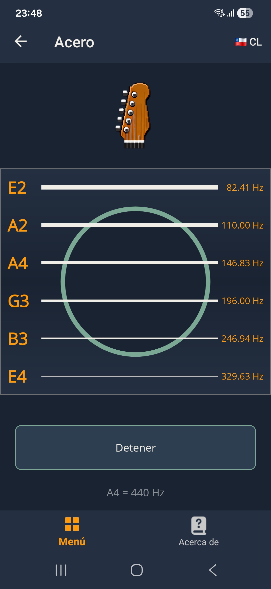 |

### Cómo se usa

1. Elige el instrumento desde la lista.
2. Toca la cuerda que quieras escuchar: suena la nota de referencia.
3. Ajusta tu instrumento hasta que el sonido coincida con el de la cuerda.

### Notas de referencia por instrumento

| Instrumento | Notas (de grave a agudo) |
|---|---|
| Guitarra nylon | E2 · A2 · D3 · G3 · B3 · E4 |
| Guitarra steel | E2 · A2 · D3 · G3 · B3 · E4 |
| Bajo | E1 · A1 · D2 · G2 |
| Ukelele | G4 · C4 · E4 · A4 |
| Violín | G3 · D4 · A4 · E5 |
| Charango | G4 · C5 · E5 · E4 · A4 · E5 |

### Consejos

- Usa un lugar silencioso para escuchar bien la nota.
- En el charango algunas cuerdas son dobles (x2): reproducen la misma nota dos veces.

---

## 3. Metrónomo

El metrónomo te ayuda a mantener un ritmo constante mientras estudias o tocas.

| | |
|---|---|
| 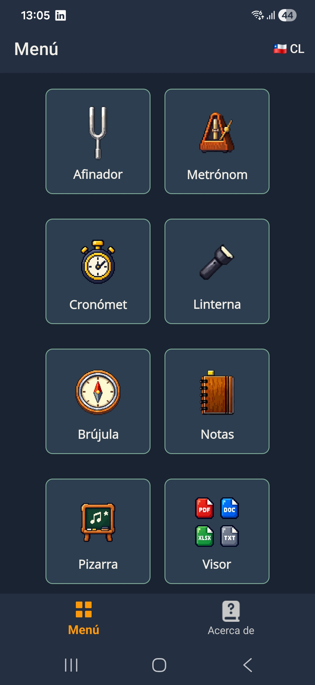 | 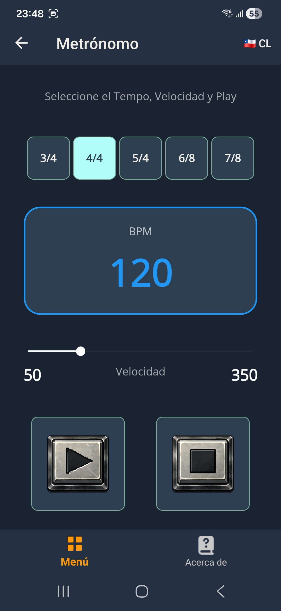 |

### Cómo se usa

1. Ajusta la velocidad con el control de BPM (pulsos por minuto).
2. Elige el compás: 3/4, 4/4, 5/4, 6/8 o 7/8.
3. Toca **Play** para comenzar y **Stop** para detenerlo.

### Consejos

- Comienza lento (60–80 BPM) y aumenta la velocidad de a poco.
- En los compases con acento (por ejemplo 4/4), el primer pulso suena más marcado.

---

## 4. Cronómetro

El cronómetro mide tiempos con vueltas (laps), ideal para entrenamientos o mediciones de precisión.

| | |
|---|---|
| 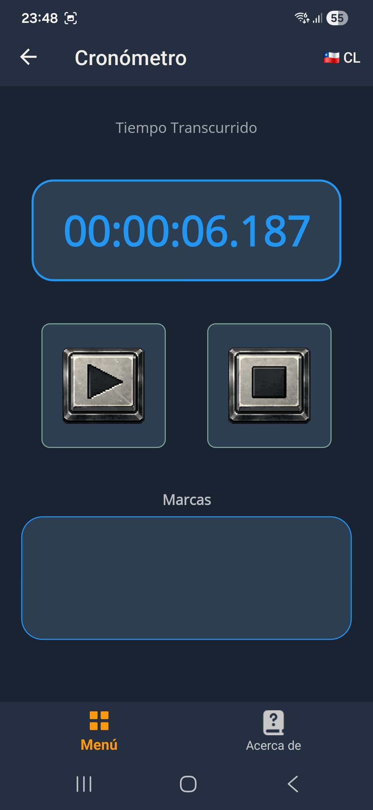 | 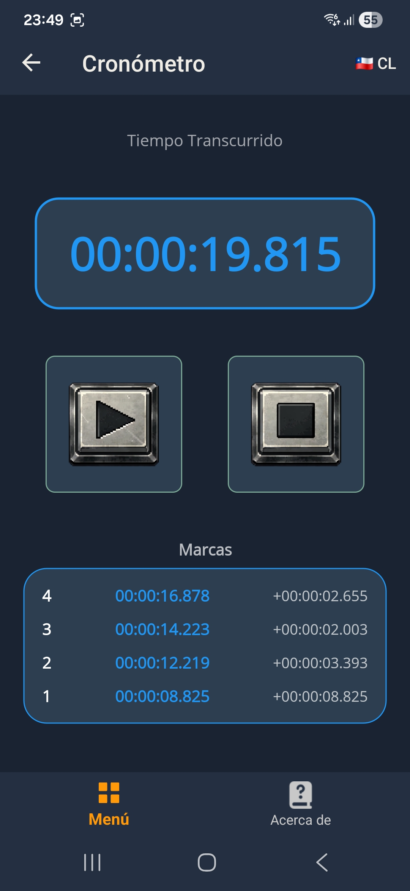 |

### Cómo se usa

- Toca el botón de **play** para comenzar a medir.
- Mientras corre, el mismo botón de play registra una **vuelta** (muestra tiempo acumulado y parcial).
- Toca el botón de **stop** para pausar.
- Toca el botón de **stop** por segunda vez (cuando está detenido) para resetear: vuelve a cero y borra las vueltas.

### Consejos

- Las vueltas se muestran en la lista de la parte de abajo, de la más reciente a la más antigua.
- El cronómetro guarda el estado mientras vuelvas a entrar a la herramienta en la misma sesión.

---

## 5. Linterna

La linterna convierte la cámara del teléfono en una fuente de luz y además incluye luz de pantalla y señales de emergencia en código Morse.

| | |
|---|---|
| 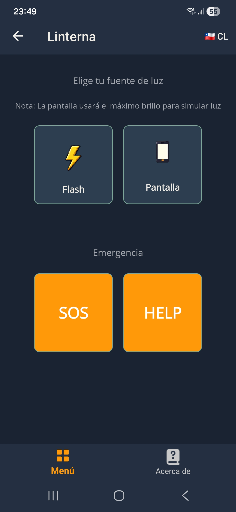 | 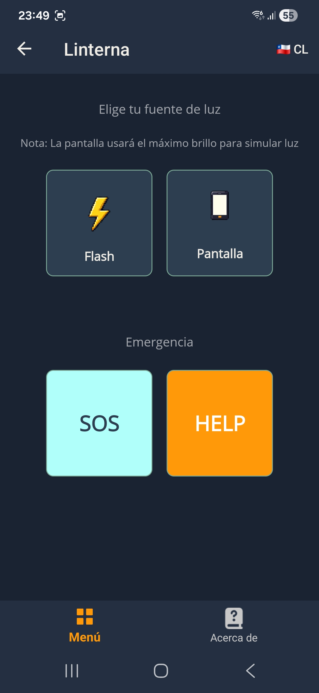 |

### Cómo se usa

- Toca el botón de **flash** para encender o apagar la luz de la cámara.
- Toca **luz de pantalla** para usar la pantalla blanca como luz (ideal para lectura).
- Usa **SOS** para emitir la señal de socorro SOS en Morse.
- Usa **HELP** para emitir la señal de ayuda HELP en Morse.

### Consejos

- Apaga la luz de pantalla al salir: la app restaura el brillo original de tu dispositivo.
- Las señales Morse se reproducen con la luz del flash; toca el mismo botón para detenerlas.

---

## 6. Brújula

La brújula te indica el norte magnético y el ángulo exacto en grados, con lecturas suavizadas para mayor estabilidad.

| | |
|---|---|
| 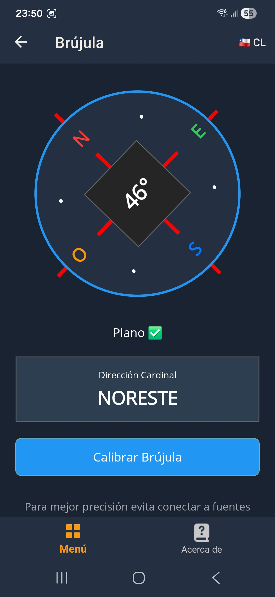 | 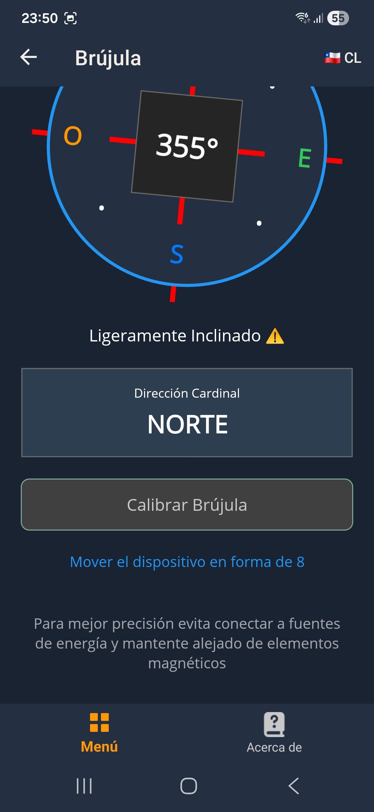 |

### Cómo se usa

- Mantén el teléfono en horizontal: la aguja indica el norte y el ángulo se muestra en grados.
- La dirección se muestra en texto (N, NE, E, SE, S, SO, O, NO).
- El indicador de inclinación te avisa cuándo el teléfono no está plano.

### Calibración

- Toca **Calibrar** y mueve el dispositivo en forma de 8 en el aire mientras la app mide.
- La calibración toma unos segundos y mejora la precisión de la lectura.

---

## 7. Notas

La herramienta de notas te permite anotar ideas, tareas o cualquier texto, y mantenerlas ordenadas y buscables.

| | |
|---|---|
| 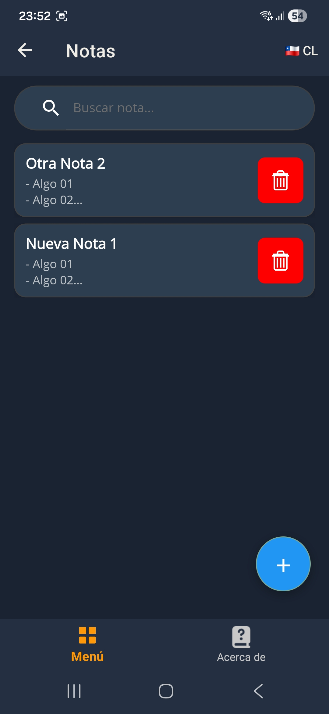 | 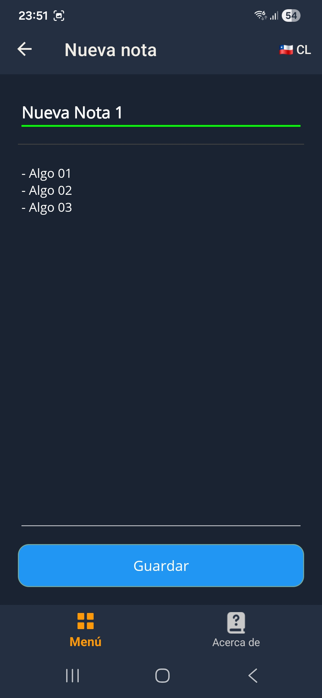 |

### Cómo se usa

- Toca el botón **nueva nota** para crear una nota.
- Escribe un título y el contenido.
- Toca **guardar** para guardarla o **atrás** para cancelar sin guardar.
- Toca una nota existente para editarla.
- Usa la lupa para buscar por título o contenido.
- Toca el botón de borrar (papelera) para eliminar una nota; la app te pide confirmación.

### Consejos

- Las notas se ordenan de la más reciente a la más antigua.
- Si una nota no tiene título ni contenido, no se guarda.

---

## 8. Lector de documentos

El lector de documentos abre y muestra archivos de todo tipo sin salir de la app.

| | |
|---|---|
| 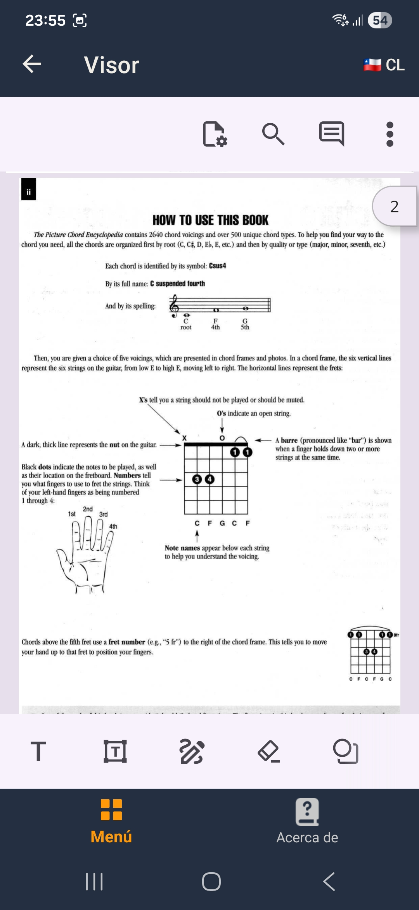 | 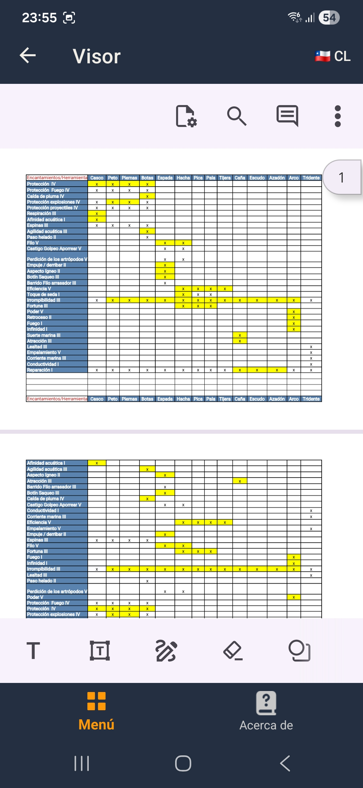 |

### Formatos soportados

| Tipo | Descripción |
|---|---|
| PDF | Se muestra directamente. |
| DOCX / XLSX / DOC / XLS | Se convierten a PDF en segundo plano y se muestran. |
| CSV | Se detecta el delimitador (coma, punto y coma o tabulación) y se convierte. |
| Texto (.txt) | Se muestra como texto plano con su nombre de archivo. |

### Cómo se usa

1. Toca **Lector de documentos** en el menú.
2. Elige el archivo en el selector del sistema.
3. El documento se abre automáticamente en el visor.

### Consejos

- Los archivos de Office pasan por una conversión; aparece un indicador de progreso mientras se prepara.
- Los archivos de texto muy grandes no se abren (límite de tamaño para cuidar el rendimiento).

---

*Fin de la guía. ¿Necesitas ayuda con algo más? Usa la sección **Acerca de** para ver la versión de la app o contactar al desarrollador.*