# NavajaSuiza .NET10

Navaja suiza digital — app multiplataforma (.NET MAUI) con herramientas de uso diario: linterna, luz de pantalla, afinador de instrumentos, metrónomo, brújula, encuadre de imagen y más.

<!-- MANUAL:INICIO - generado por .github/scripts/sync-manual.py, no editar a mano -->

## Manual de usuario — Navaja Suiza

Bienvenido a la Navaja Suiza. Este manual te explica, paso a paso, cómo usar cada herramienta de la aplicación.

> Este manual es un documento vivo: se actualiza a medida que la aplicación suma funciones.

---

### Contenido

1. Pizarra
2. Afinador
3. Metrónomo
4. Cronómetro
5. Linterna
6. Brújula
7. Notas
8. Lector de documentos
9. Estado del dispositivo

---

### 1. Pizarra

La pizarra te permite dibujar a mano alzada sobre una superficie blanca y guardar tu dibujo como imagen.

| | |
|---|---|
| 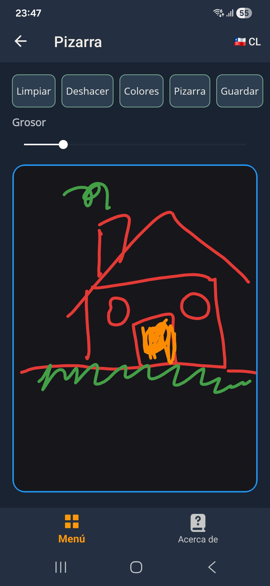 | 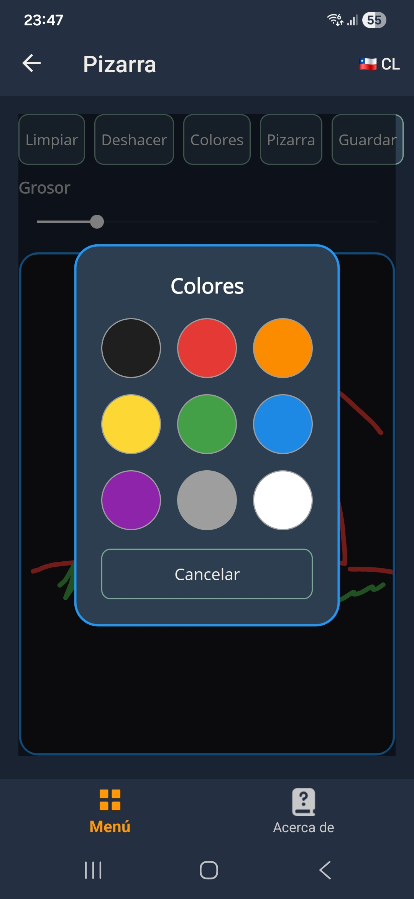 |

#### Cómo se usa

- Elige un color con el botón de la paleta (rueda de colores).
- Dibuja arrastrando el dedo sobre la superficie blanca.
- Agrega texto con el botón de texto y toca el lienzo donde quieras escribirlo.
- Usa el borrador para corregir un trazo.
- Deshaz el último trazo o texto con el botón de la flecha.
- Limpia toda la pizarra con el botón de la papelera.
- Guarda tu dibujo como imagen con el botón de guardar.

#### Consejos

- El grosor del trazo se ajusta con el control deslizante de la parte de arriba.
- La pizarra se adapta al tema claro y oscuro de la aplicación.
- Si cambias el color del fondo, el lápiz ajusta su contraste automáticamente para que siempre se vea.

---

### 2. Afinador

El afinador te permite reproducir las notas de varios instrumentos para afinar el tuyo de oído. Están disponibles:

- Guitarra y guitarra criolla (nylon).
- Guitarra steel (acero).
- Bajo.
- Ukelele.
- Violín.
- Charango.

| | |
|---|---|
| 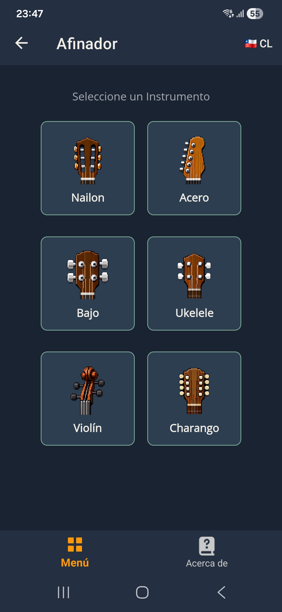 | 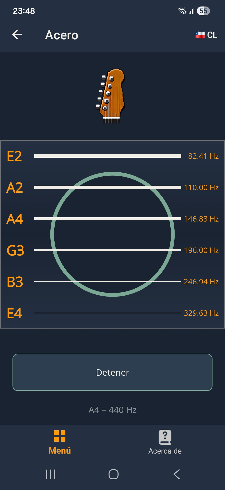 |

#### Cómo se usa

1. Elige el instrumento desde la lista.
2. Toca la cuerda que quieras escuchar: suena la nota de referencia.
3. Ajusta tu instrumento hasta que el sonido coincida con el de la cuerda.

#### Notas de referencia por instrumento

| Instrumento | Notas (de grave a agudo) |
|---|---|
| Guitarra nylon | E2 · A2 · D3 · G3 · B3 · E4 |
| Guitarra steel | E2 · A2 · D3 · G3 · B3 · E4 |
| Bajo | E1 · A1 · D2 · G2 |
| Ukelele | G4 · C4 · E4 · A4 |
| Violín | G3 · D4 · A4 · E5 |
| Charango | G4 · C5 · E5 · E4 · A4 · E5 |

#### Consejos

- Usa un lugar silencioso para escuchar bien la nota.
- En el charango algunas cuerdas son dobles (x2): reproducen la misma nota dos veces.

---

### 3. Metrónomo

El metrónomo te ayuda a mantener un ritmo constante mientras estudias o tocas.

| | |
|---|---|
| 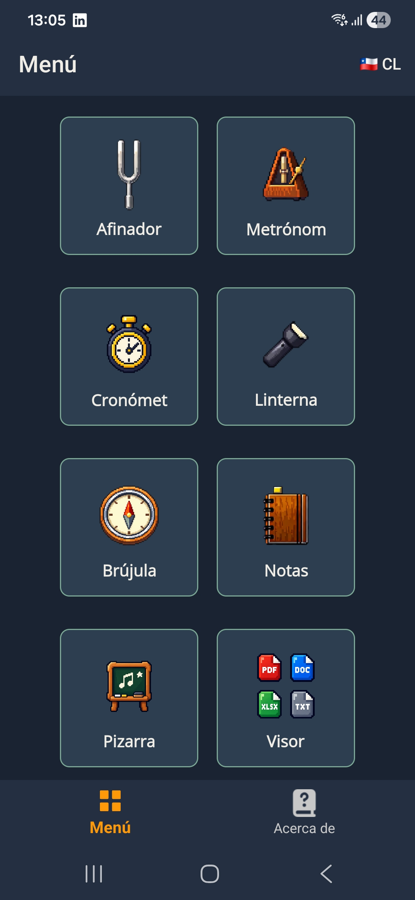 | 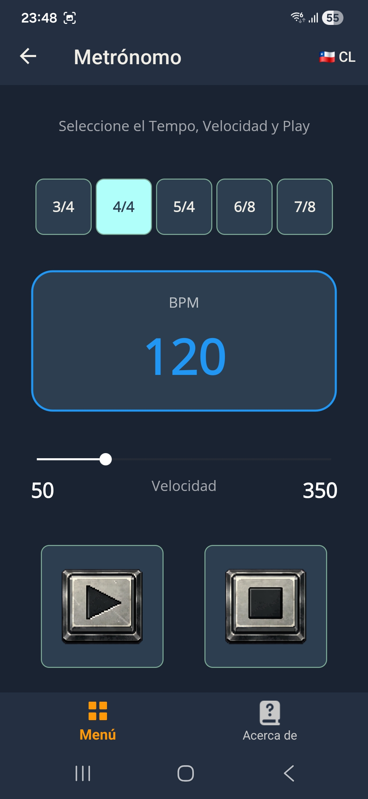 |

#### Cómo se usa

1. Ajusta la velocidad con el control de BPM (pulsos por minuto).
2. Elige el compás: 3/4, 4/4, 5/4, 6/8 o 7/8.
3. Toca **Play** para comenzar y **Stop** para detenerlo.

#### Consejos

- Comienza lento (60–80 BPM) y aumenta la velocidad de a poco.
- En los compases con acento (por ejemplo 4/4), el primer pulso suena más marcado.

---

### 4. Cronómetro

El cronómetro mide tiempos con vueltas (laps), ideal para entrenamientos o mediciones de precisión.

| | |
|---|---|
| 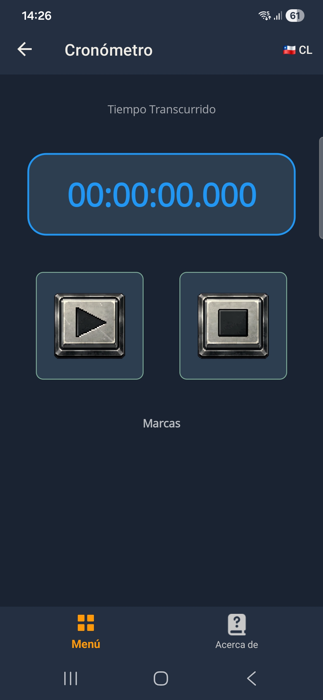 | 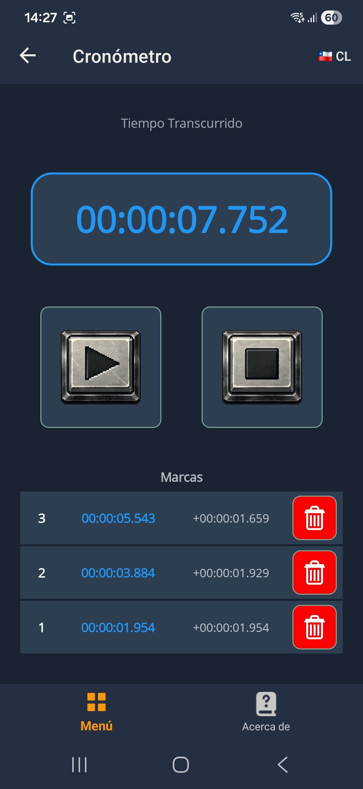 |

#### Cómo se usa

- Toca el botón de **play** para comenzar a medir.
- Mientras corre, el mismo botón de play registra una **vuelta** (muestra tiempo acumulado y parcial).
- Toca el botón de **stop** para pausar.
- Toca el botón de **stop** por segunda vez (cuando está detenido) para resetear: vuelve a cero y borra las vueltas.

#### Consejos

- Las vueltas se muestran en la lista de la parte de abajo, de la más reciente a la más antigua.
- El cronómetro guarda el estado mientras vuelvas a entrar a la herramienta en la misma sesión.

---

### 5. Linterna

La linterna convierte la cámara del teléfono en una fuente de luz y además incluye luz de pantalla y señales de emergencia en código Morse.

| | |
|---|---|
| 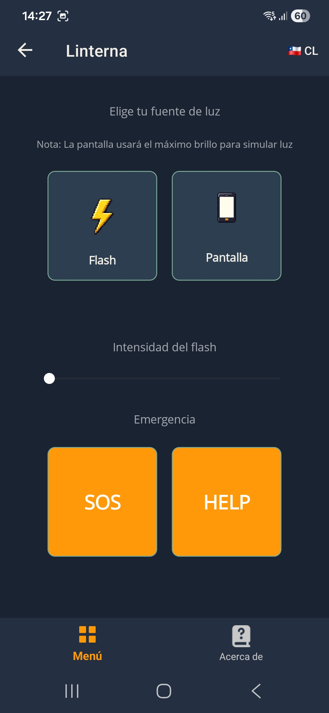 | 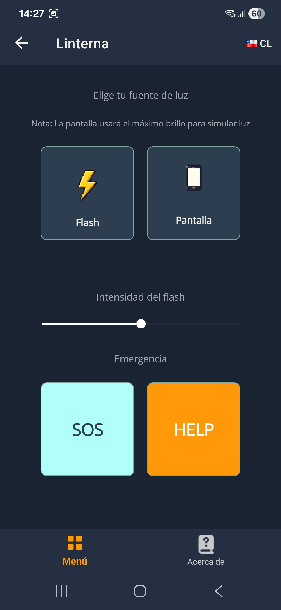 |

#### Cómo se usa

- Toca el botón de **flash** para encender o apagar la luz de la cámara.
- Toca **luz de pantalla** para usar la pantalla blanca como luz (ideal para lectura).
- Usa **SOS** para emitir la señal de socorro SOS en Morse.
- Usa **HELP** para emitir la señal de ayuda HELP en Morse.

#### Consejos

- Apaga la luz de pantalla al salir: la app restaura el brillo original de tu dispositivo.
- Las señales Morse se reproducen con la luz del flash; toca el mismo botón para detenerlas.

---

### 6. Brújula

La brújula te indica el norte magnético y el ángulo exacto en grados, con lecturas suavizadas para mayor estabilidad.

| | |
|---|---|
| 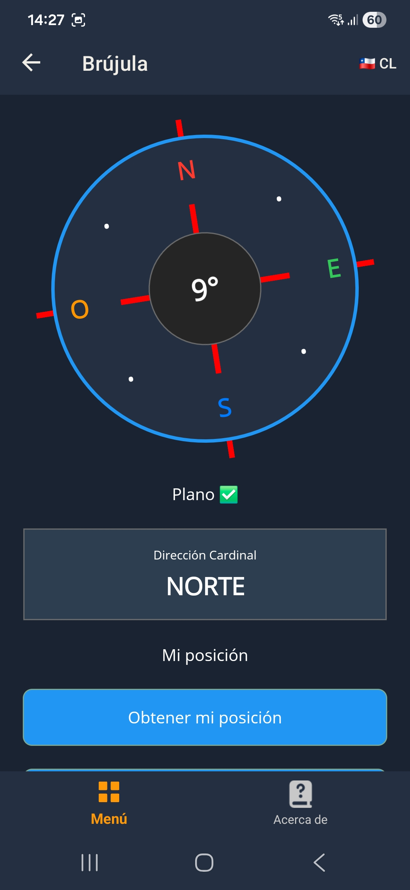 | 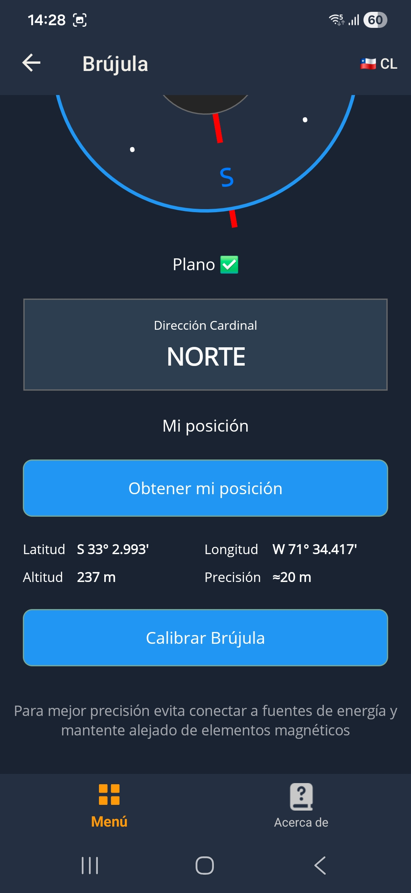 |

#### Cómo se usa

- Mantén el teléfono en horizontal: la aguja indica el norte y el ángulo se muestra en grados.
- La dirección se muestra en texto (N, NE, E, SE, S, SO, O, NO).
- El indicador de inclinación te avisa cuándo el teléfono no está plano.

#### Calibración

- Toca **Calibrar** y mueve el dispositivo en forma de 8 en el aire mientras la app mide.
- La calibración toma unos segundos y mejora la precisión de la lectura.

---

### 7. Notas

La herramienta de notas te permite anotar ideas, tareas o cualquier texto, y mantenerlas ordenadas y buscables.

| | |
|---|---|
| 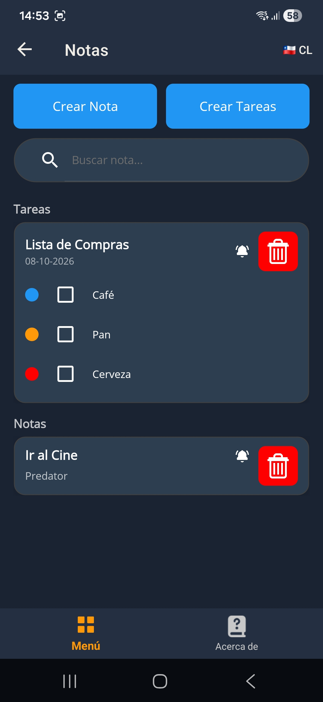 | 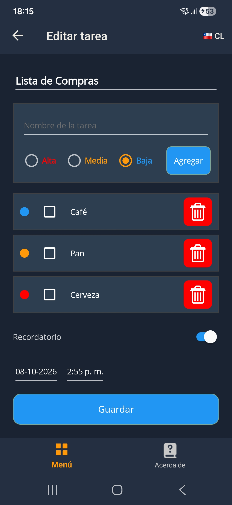 |

#### Cómo se usa

- Toca el botón **nueva nota** para crear una nota.
- Escribe un título y el contenido.
- Toca **guardar** para guardarla o **atrás** para cancelar sin guardar.
- Toca una nota existente para editarla.
- Usa la lupa para buscar por título o contenido.
- Toca el botón de borrar (papelera) para eliminar una nota; la app te pide confirmación.

#### Consejos

- Las notas se ordenan de la más reciente a la más antigua.
- Si una nota no tiene título ni contenido, no se guarda.

---

### 8. Lector de documentos

El lector de documentos abre y muestra archivos de todo tipo sin salir de la app.

| | |
|---|---|
| 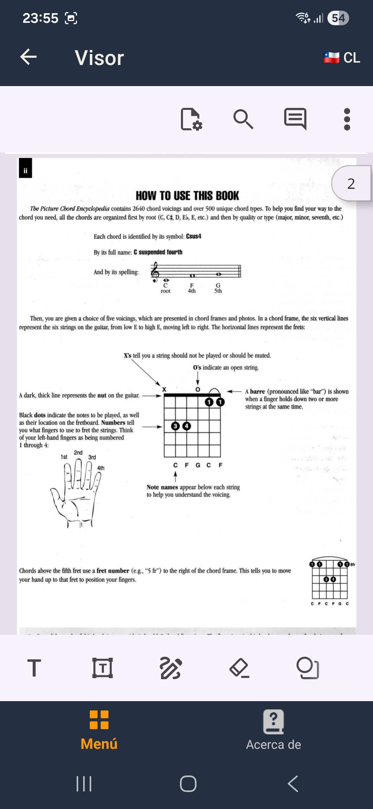 | 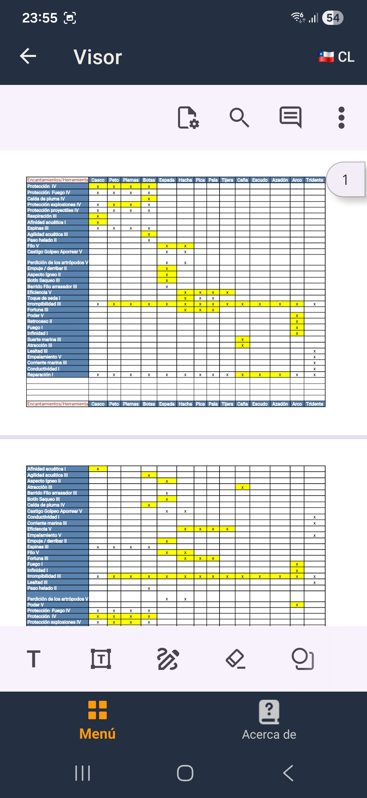 |

#### Formatos soportados

| Tipo | Descripción |
|---|---|
| PDF | Se muestra directamente. |
| DOCX / XLSX / DOC / XLS | Se convierten a PDF en segundo plano y se muestran. |
| CSV | Se detecta el delimitador (coma, punto y coma o tabulación) y se convierte. |
| Texto (.txt) | Se muestra como texto plano con su nombre de archivo. |

#### Cómo se usa

1. Toca **Lector de documentos** en el menú.
2. Elige el archivo en el selector del sistema.
3. El documento se abre automáticamente en el visor.

#### Consejos

- Los archivos de Office pasan por una conversión; aparece un indicador de progreso mientras se prepara.
- Los archivos de texto muy grandes no se abren (límite de tamaño para cuidar el rendimiento).

---

### 9. Estado del dispositivo

El menú superior muestra dos indicadores con un punto de color: **batería** y **almacenamiento**. El punto resume el estado y el número a la derecha te da el valor exacto, así que el color nunca es la única información.

#### Qué significan los colores

| Color | Significado |
|---|---|
| Azul | Estado normal |
| Naranja | Estado de alerta |
| Rojo | Estado crítico |
| Gris | No se pudo leer el valor |

Un punto gris significa que el sistema no entregó la lectura. Si el teléfono lo mantiene en gris mucho tiempo, la app puede no tener permiso para esa información.

#### Batería

| Color | Porcentaje de carga |
|---|---|
| Azul | 60% o más |
| Naranja | Entre 31% y 59% |
| Rojo | 30% o menos |

#### Almacenamiento

| Color | Espacio libre |
|---|---|
| Azul | 5 GB o más |
| Naranja | Entre 2 GB y 5 GB |
| Rojo | Menos de 2 GB |

El almacenamiento se mide en GB libres, no en porcentaje.

Los valores se actualizan cada vez que abres el menú, así que no es un monitoreo en tiempo real.

#### Consejos

- El número mostrado es el espacio **disponible**, no el usado. Si necesitas el total, lo verás en los ajustes de tu teléfono.
- La capacidad que muestra el sistema (por ejemplo 128 GB) suele ser mayor que el espacio realmente utilizable, porque una parte se reserva para el sistema. Por eso los números de la app y los de los ajustes no siempre coinciden.

---

*Fin del manual. ¿Necesitas ayuda con algo más? Usa la sección **Acerca de** para ver la versión de la app o contactar al desarrollador.*

<!-- MANUAL:FIN -->

## Dependencias

| Paquete | Versión |
|---------|---------|
| CommunityToolkit.Maui | 15.0.1 |
| CommunityToolkit.Maui.MediaElement | 10.0.0 |
| CommunityToolkit.Mvvm | 8.4.2 |
| Microsoft.Extensions.Logging.Debug | 10.0.12 |
| Microsoft.Maui.Controls | 10.0.110 |
| SkiaSharp | 4.152.1 |
| sqlite-net-pcl | 1.11.285 |
| Syncfusion.Maui.Toolkit | 1.0.11 |
| Syncfusion.Maui.PdfViewer | 34.2.9 |
| Syncfusion.DocIORenderer.NET | 34.2.9 |
| Syncfusion.XlsIORenderer.NET | 34.2.9 |
| Syncfusion.Licensing | 34.2.9 |
| Markdig | 1.4.0 |

## Permisos Android (AndroidManifest)

- `CAMERA`
- `FLASHLIGHT`

`INTERNET` lo re-inyecta `CommunityToolkit.Maui` en el manifest fusionado (permiso *normal*, se conserva). Eliminados por principio de mínimo privilegio: `BATTERY_STATS`, `ACCESS_FINE_LOCATION`, `ACCESS_COARSE_LOCATION`, `ACCESS_NETWORK_STATE`.

## Estructura

```
NavajaSuiza_.NET10.sln
│
├── NavajaSuiza.Core/                    # Class Library (net10.0 puro, sin dependencias MAUI)
│   ├── Interfaces/                      # 23 interfaces
│   │   ├── IAppInfoService.cs
│   │   ├── ICompassService.cs
│   │   ├── IDeviceDisplayService.cs
│   │   ├── IDeviceStatusService.cs
│   │   ├── IDocumentPdfConverter.cs
│   │   ├── IFilePickerService.cs
│   │   ├── IFlashlightService.cs
│   │   ├── IFlashlightStateService.cs
│   │   ├── IImagePickerService.cs
│   │   ├── IInstrumentAudioService.cs
│   │   ├── ILanguageService.cs
│   │   ├── ILauncherService.cs
│   │   ├── IMarkdownToHtmlConverter.cs
│   │   ├── IMetronomeService.cs
│   │   ├── IMorseSignalService.cs
│   │   ├── INavigationService.cs
│   │   ├── INotesRepository.cs
│   │   ├── IOrientationService.cs
│   │   ├── IPizarraImageExporter.cs
│   │   ├── IScreenBrightnessService.cs
│   │   ├── IStopwatchService.cs
│   │   ├── IThemeService.cs
│   │   └── ITimeSource.cs
│   ├── Models/
│   │   ├── SupportedLanguages.cs
│   │   ├── InstrumentStringData.cs
│   │   ├── PizarraStroke.cs
│   │   ├── StopwatchLap.cs
│   │   ├── DocumentType.cs
│   │   ├── PdfReaderPayload.cs
│   │   ├── MorseSignalSequence.cs
│   │   └── Note.cs
│   ├── Services/
│   │   ├── FlashlightStateService.cs
│   │   ├── StopwatchService.cs
│   │   ├── MarkdownToHtmlConverter.cs
│   │   ├── MorseSignalService.cs
│   │   └── DocumentTypeDetector.cs
│   ├── ViewModels/                       # 24 archivos (testables, sin dependencias MAUI)
│   │   ├── BaseViewModel.cs
│   │   ├── AboutViewModel.cs
│   │   ├── CompassViewModel.cs
│   │   ├── FlashlightViewModel.cs
│   │   ├── FramingViewModel.cs
│   │   ├── GuideViewModel.cs
│   │   ├── MenuViewModel.cs
│   │   ├── MetronomeViewModel.cs
│   │   ├── ManualViewModel.cs
│   │   ├── NoteEditorViewModel.cs
│   │   ├── NotesViewModel.cs
│   │   ├── PdfReaderViewModel.cs
│   │   ├── TextReaderViewModel.cs
│   │   ├── PizarraViewModel.cs
│   │   ├── ScreenLightViewModel.cs
│   │   ├── StopwatchViewModel.cs
│   │   ├── TunerViewModel.cs
│   │   ├── InstrumentViewModelBase.cs
│   │   ├── InstrumentBassViewModel.cs
│   │   ├── InstrumentCharangoViewModel.cs
│   │   ├── InstrumentNylonViewModel.cs
│   │   ├── InstrumentSteelViewModel.cs
│   │   ├── InstrumentUkuleleViewModel.cs
│   │   └── InstrumentViolinViewModel.cs
│   └── AppConstants.cs
│
├── NavajaSuiza_.NET10/                  # Proyecto MAUI
│   ├── Pages/
│   │   ├── Components/
│   │   │   ├── InstrumentBody.xaml/cs
│   │   │   ├── InstrumentStringComponent.xaml/cs
│   │   │   └── LoadingComponent.xaml/cs
│   │   └── *.xaml/cs
│   ├── ViewModels/                       # Vacío — todas las VMs están en Core
│   ├── Services/
│   │   └── Implementations/             # 19 implementaciones (APIs de plataforma + repos de datos)
│   │       ├── AppInfoService.cs
│   │       ├── CompassSensorService.cs
│   │       ├── DeviceDisplayService.cs
│   │       ├── DeviceStatusService.cs
│   │       ├── DocumentPdfConverter.cs
│   │       ├── FilePickerService.cs
│   │       ├── FlashlightService.cs
│   │       ├── ImagePickerService.cs
│   │       ├── InstrumentAudioService.cs
│   │       ├── LanguageService.cs
│   │       ├── LauncherService.cs
│   │       ├── MetronomeService.cs
│   │       ├── NavigationService.cs
│   │       ├── NoteEntity.cs
│   │       ├── OrientationSensorService.cs
│   │       ├── PizarraImageExporter.cs
│   │       ├── RealtimeTimeSource.cs
│   │       ├── ScreenBrightnessService.cs
│   │       ├── SqliteNotesRepository.cs
│   │       └── ThemeService.cs
│   ├── Converters/
│   ├── Extensions/
│   ├── Resources/
│   │   ├── Languages/
│   │   │   ├── AppResources.resx       # Default (es-CL)
│   │   │   ├── AppResources.en.resx    # Inglés
│   │   │   └── AppResources.sv.resx    # Sueco
│   │   ├── Raw/
│   │   │   ├── Audio/                   # Assets de audio WAV (32 archivos)
│   │   │   └── guide/                   # Guía del usuario (USER_GUIDE.{es,en,sv}.md + imágenes)
│   │   └── Styles/
│   ├── Platforms/
│   ├── App.xaml/cs
│   ├── AppShell.xaml/cs
│   └── MauiProgram.cs
│
├── NavajaSuiza.Test/                    # Proyecto de tests (net10.0 puro)
│   ├── AboutViewModelTests.cs
│   ├── AppConstantsTests.cs
│   ├── BaseViewModelTests.cs
│   ├── CompassViewModelTests.cs
│   ├── DocumentTypeDetectorTests.cs
│   ├── FlashlightStateServiceTests.cs
│   ├── FlashlightViewModelTests.cs
│   ├── FramingViewModelTests.cs
│   ├── InstrumentStringDataTests.cs
│   ├── InstrumentViewModelTests.cs
│   ├── MarkdownToHtmlConverterTests.cs
│   ├── MenuViewModelTests.cs
│   ├── MetronomeViewModelTests.cs
│   ├── MorseSignalSequenceTests.cs
│   ├── MorseSignalServiceTests.cs
│   ├── NoteEditorViewModelTests.cs
│   ├── NotesViewModelTests.cs
│   ├── PdfReaderViewModelTests.cs
│   ├── PizarraViewModelTests.cs
│   ├── ScreenLightViewModelTests.cs
│   ├── StopwatchServiceTests.cs
│   ├── StopwatchViewModelTests.cs
│   └── TunerViewModelTests.cs
│
├── .editorconfig                        # Convenciones de código
└── .github/workflows/build.yml          # CI/CD: build + test en push/PR
```

## Release App

> **Antes de publicar**: registra tu clave de licencia Syncfusion (**Community License**, gratuita y definitiva; la *trial* dura 30 días y genera aviso en el visor de PDF — confirma el tipo en tu panel de cuentas de Syncfusion antes de publicar). La clave se configura **una sola vez** como variable de entorno de Windows: Inicio → "Variables de entorno" → **Nueva** en *Variables de usuario* → nombre `SYNC_FUSION_LICENSE_KEY`, valor la clave → reiniciar Visual Studio. En build se inyecta como `AssemblyMetadata` desde esa variable o con `-p:SyncfusionLicenseKey=...`; **nunca se versiona en el repositorio**. Sin clave configurada, el proyecto compila igual (sin registro).

### AAB (Google Play)

Google Play **no acepta APK**, requiere un **App Bundle (.aab)** firmado. El `csproj` genera `.aab` en Release Android por defecto.

1. Cambiar configuración de **Debug** a **Release**
2. Click derecho al proyecto `NavajaSuiza_.NET10` → **Archive**
3. Seleccionar **Signing** (usar el keystore de producción, guardarlo de forma permanente y con backup: perderlo impide actualizar la app)
4. Subir el `.aab` generado a **Play Console**. Play App Signing firma el APK final; el keystore es la *upload key*

> El keystore (`.keystore`, `.jks`, `.p12`) está excluido del repo vía `.gitignore`. Guárdalo **fuera** del repositorio y respáldalo de forma segura.

> **Regla**: el keystore del APK de prueba debe ser el **mismo** que el del AAB final; si cambias de firma, Play rechaza la actualización.

> **Dónde NO configurar la firma**: en *Properties → Android Signing* (Android Firma de Paquete) las contraseñas quedan en el `.csproj`, que **se versiona en GitHub**. Usar el flujo **Archive → Ad Hoc** (perfil de firma fuera del proyecto) o las properties por línea de comandos/CI.

> **El diálogo Ad Hoc no lleva la clave Syncfusion**: ahí solo van los datos del keystore (alias, contraseña, archivo). La licencia va en la variable `SYNC_FUSION_LICENSE_KEY` (ver arriba).

> Para generar un **APK** de prueba (instalación directa en dispositivo), compilar Release con `-p:AndroidPackageFormat=apk`. El APK Release es **multirarquitectura** (fat APK): incluye `arm64-v8a`, `armeabi-v7a` (32-bit) y `x86_64` gracias a los `RuntimeIdentifiers` del `.csproj`.

> Si no tienes keystore, créalo con `keytool -genkey -v -keystore filename.keystore -alias alias -keyalg RSA -keysize 2048 -validity 10000` (requiere un JDK en la máquina), o desde el wizard de **Archive** de Visual Studio (Tools → Android → Archive → "+" en Signing).

### Cuenta y proceso en Google Play Console (a grandes rasgos)

Antes de subir el `.aab`, la app debe existir en **Play Console** y cumplir el trámite de alta. Resumen del recorrido (los detalles exactos de cada formulario cambian según la región y la cuenta):

1. **Crear la cuenta de desarrollador** en [play.google.com/console](https://play.google.com/console):
   - Se elige tipo **"Tú"** (personal) u **"Organización"** (empresa verificada).
   - Se proporcionan nombre legal, dirección y sitio web; se vincula un **perfil de pagos** de Google.
   - Se paga la **cuota única de USD 25**.
   - La **Cuenta de Google propietaria no se puede cambiar** después (se puede invitar a otros usuarios, y actualizar el tipo de cuenta más adelante si se constituye una empresa).
2. **Crear la app**: nombre, idioma por defecto, tipo (App/Juego) y si es gratis o de pago. Se aceptan las declaraciones de **Políticas del programa**, **Play App Signing** (obligatorio para AAB) y **leyes de exportación de EE. UU.**
3. **Configurar la app** (bloqueante antes de publicar):
   - **Ficha de Play Store**: nombre, descripción breve y completa, ícono 512×512, gráfico de funciones 1024×500 y 2–8 capturas de teléfono (proporción 16:9 o 9:16).
   - **Contenido de la app**: clasificación de edad (IARC), anuncios, público objetivo, y si es gubernamental, de salud o con funciones financieras.
   - **Seguridad de los datos (Data Safety)**: se declara qué datos se recopilan/comparten (esta app: **ninguno**, todo local) + URL de la política de privacidad.
4. **Subir una versión**: en **Prueba y lanza** se crea una versión (cerrada o de producción) y se sube el `.aab` firmado con sus notas de versión.

> **Prueba cerrada obligatoria (cuentas personales nuevas)**: para poder publicar en producción, Google exige ejecutar una **prueba cerrada de al menos 14 días con un mínimo de 12 verificadores** que acepten participar. Se sube el mismo `.aab` a la pista *Prueba cerrada*, se agregan los correos de los verificadores y se comparte el **link de participación** (ellos aceptan e instalan desde Play). Cumplido el plazo, se **solicita acceso a producción**.

> **Inicio de sesión**: "Google Cloud" es otro producto (servicios cloud) y **no** es donde se publica la app; todo el trámite ocurre en **Play Console**.

> **Privacidad de los datos**: si la cuenta es personal y **no** se declara que se ganan dinero, Google **no muestra públicamente** la dirección legal del desarrollador.

### APK (Android)

> Probar en dispositivo real con **Archive → Distribuir → Ad Hoc** (selecciona el keystore en el diálogo). Evitar *Properties → Android Signing*: escribe contraseñas en el `.csproj` versionado.

1. Cambiar configuración de **Debug** a **Release**
2. Click derecho al proyecto `NavajaSuiza_.NET10` → **Archive**
3. Esperar la compilación → **Distribuir → Ad Hoc**
4. Seleccionar/crear el keystore (mismo que se usará para el AAB final)
5. Instalar el APK en el dispositivo, o compilar por CLI:
   - Estado del arte: con `-p:AndroidPackageFormat=apk`, el Release genera el APK firmado en:
   ```
   bin/Release/net10.0-android/com.nefelin.navajasuiza-Signed.apk
   ```
   - Sin ese parámetro (default), el Release genera el AAB en:
   ```
   bin/Release/net10.0-android/com.nefelin.navajasuiza.aab
   ```

### Windows

1. Cambiar a **Release**
2. Build → Clean Solution → Rebuild Solution
3. El ejecutable se genera en:
   ```
   bin/Release/net10.0-windows10.0.19041.0/win-x64/
   ```

## Languages

### Archivos de recursos
- `Resources/Languages/AppResources.resx` — Default (es-CL)
- `Resources/Languages/AppResources.en.resx` — Inglés
- `Resources/Languages/AppResources.sv.resx` — Sueco

### Uso en XAML
```xml
xmlns:extensions="clr-namespace:NavajaSuiza_.NET10.Extensions"

Title="{extensions:Translate MenuText}"
```

### Uso en C#
```csharp
var selectLanguage = LocalizationResourceManager.Instance["SelectLanguageText"].ToString();
var cancelText = LocalizationResourceManager.Instance["CancelText"]?.ToString();
```

## CI/CD

GitHub Actions workflow en `.github/workflows/build.yml`:
- Ejecuta en push y PR a `main`
- Steps: `dotnet restore` → `dotnet build` → `dotnet run --project NavajaSuiza.Test/NavajaSuiza.Test.csproj` (la suite usa xUnit.net v3 con runner in-process; `dotnet test` no es compatible con el SDK de .NET 10)

## Convenciones de código

`.editorconfig` en raíz del repo con reglas de naming, formato y suppressions de analyzers.

## Licencia

Este proyecto se distribuye bajo la **Licencia MIT** (ver `LICENSE.txt`).

> **Aviso sobre componentes de terceros:** este proyecto utiliza componentes de [Syncfusion](https://www.syncfusion.com) (`Syncfusion.DocIORenderer.NET`, `Syncfusion.XlsIORenderer.NET`, `Syncfusion.Maui.PdfViewer`, `Syncfusion.Maui.Toolkit`), que **no están cubiertos por la licencia MIT** de este repositorio. Los componentes Syncfusion se usan bajo su licencia correspondiente y siguen sujetos a los términos y condiciones de Syncfusion. No redistribuyas los binarios de Syncfusion fuera de los términos permitidos por su licencia.
